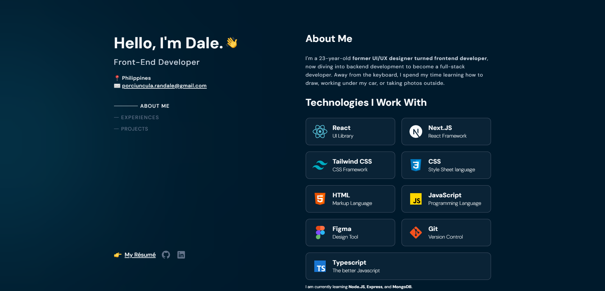

<h1>My First Portfolio Website</h1>

  

<h3 align="center">
  <a href="https://randale-porciuncula.pages.dev" target="_blank" rel="noopener noreferrer">randale-porciuncula.pages.dev</a>
</h3>

---

    

<h2 style="margin-top: 25px">About</h2>

 This is my first portfolio website. I took inspiration from <b>Brittany Chiang's <a href='https://brittanychiang.com/' target="_blank" rel="noopener noreferrer">website</a></b> but gave it my own twist to better show how I approach design and development.

It’s a simple way for recruiters, clients, or anyone interested to check out my work and learn more about me.
The website is designed to be clean and easy to navigate, with sections for my projects, a bit about me, and ways to get in touch. It’s basically my resume but a lot more fun and interactive.

<h2 style="margin-top: 25px">Features</h2>

- Responsive Design
    - The website is fully responsive, ensuring a seamless experience across all device sizes (mobile, tablet, desktop).

- Interactive UI
    - Includes interactive elements like hover effects, buttons, and smooth animations to enhance user engagement.

- Projects Section
    - Features various projects that demonstrate my skills in front-end development, including code snippets, screenshots, and links to live demos or GitHub repositories.

- User-Centric Navigation
    - Clear and intuitive navigation with easy access to my projects, contact information, and more.

<h2 style="margin-top: 25px">Technologies Used</h2>

Built using <b><a href='https://react.dev/' target="_blank" rel="noopener noreferrer">React</a></b> and <b><a href='https://vite.dev/' target="_blank" rel="noopener noreferrer">Vite</a></b>. Hosted on <b><a href='https://pages.cloudflare.com/' target="_blank" rel="noopener noreferrer">Cloudflare Pages</a></b> Styled with <b><a href='https://tailwindcss.com/' target="_blank" rel="noopener noreferrer">Tailwind CSS</a></b>.

  

<h2 style="margin-top: 25px">How To Use</h2>

  If you'd like to fork this and use it for your own portfolio, feel free to do so! Just be sure to give proper credit. Below are the steps to set it up:

<h3>Installation</h3>

1. <b>Clone The Repository</b>

    

2. <b>Navigate To The Cloned Repository</b>

    

3. <b>Install Dependencies</b>

    

3. <b>Start the Development Server</b>

    

<h2 style="margin-top: 25px">License</h2>

This project is licensed under the MIT License - see the [LICENSE.md](LICENSE.md) file for more details.

<h2 style="margin-top: 25px">The End</h2>

If you like my portfolio website don't forget give it a ⭐ !!

